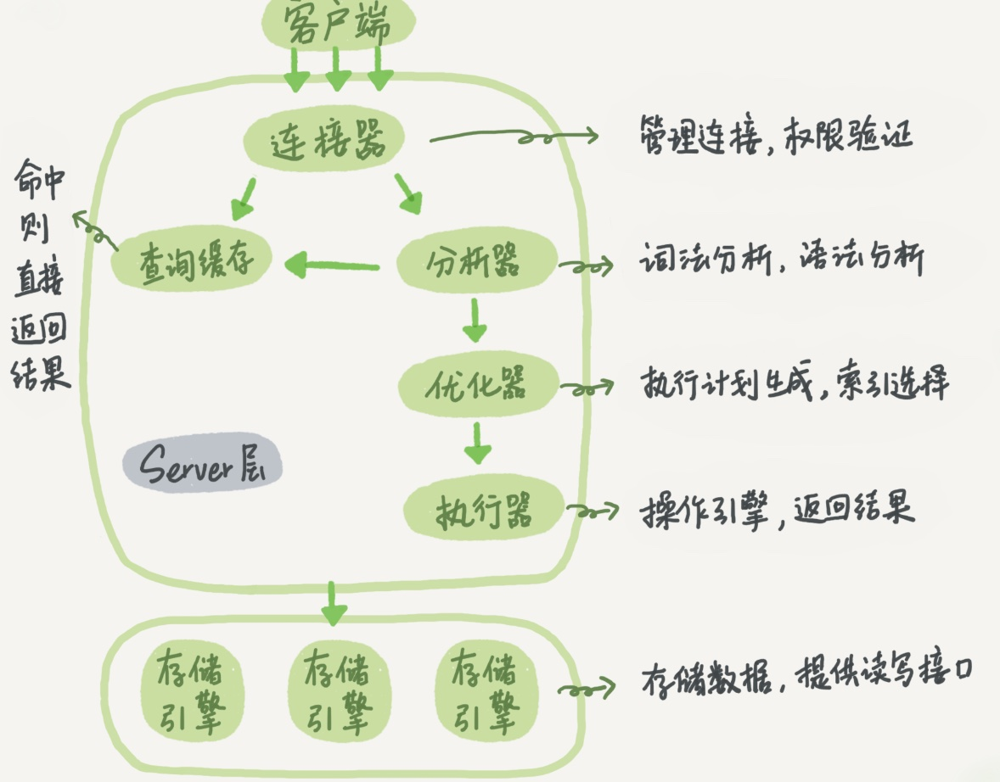
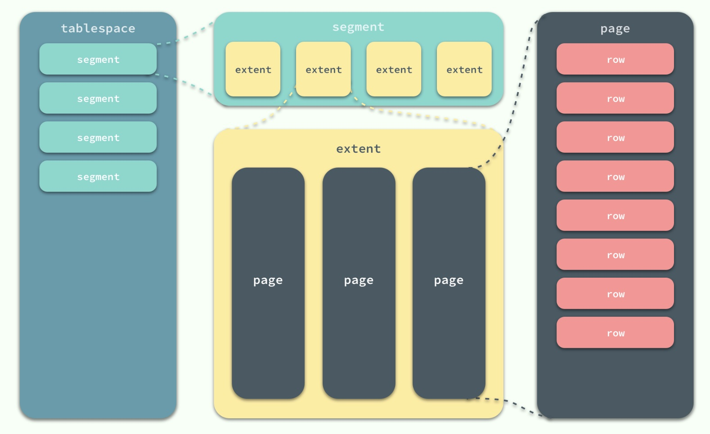
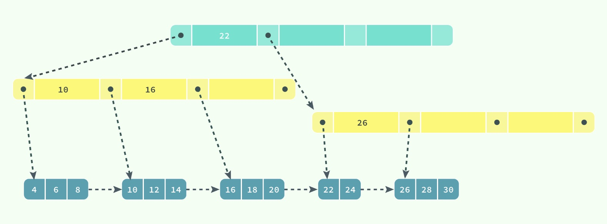
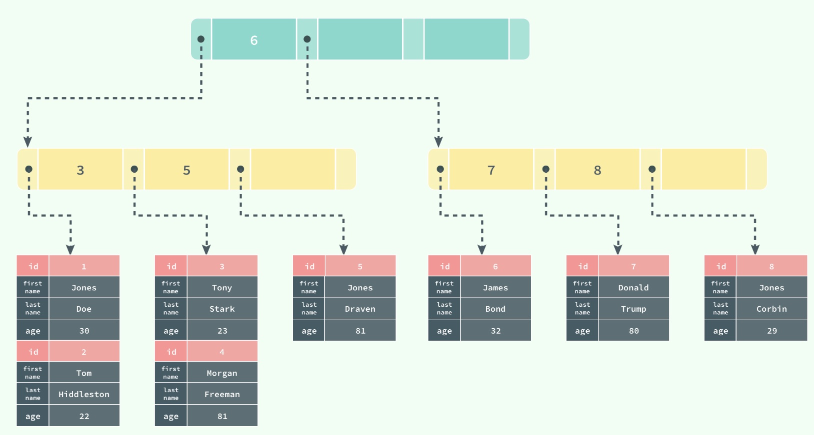
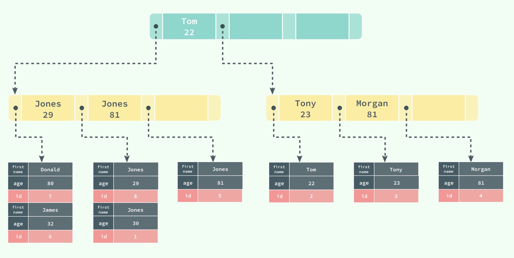
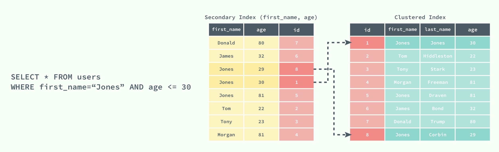
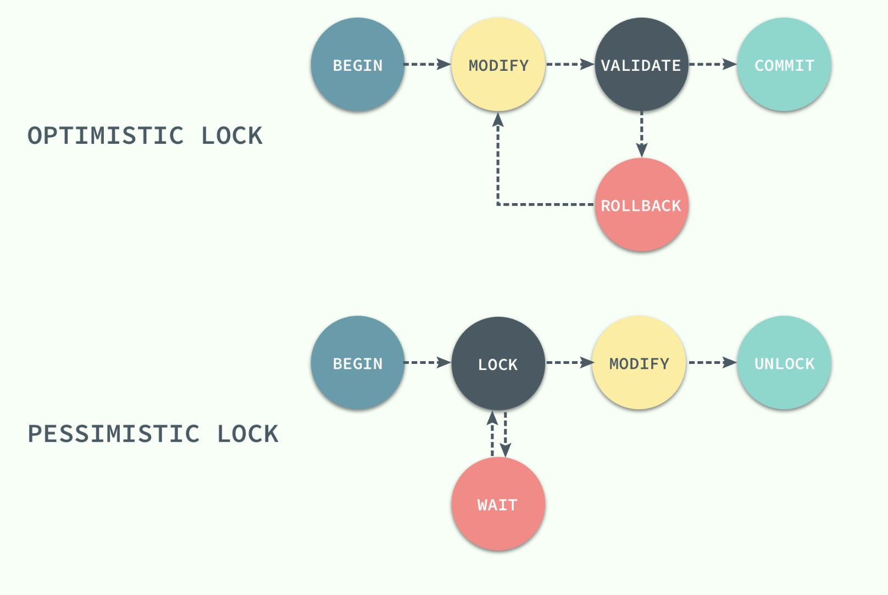
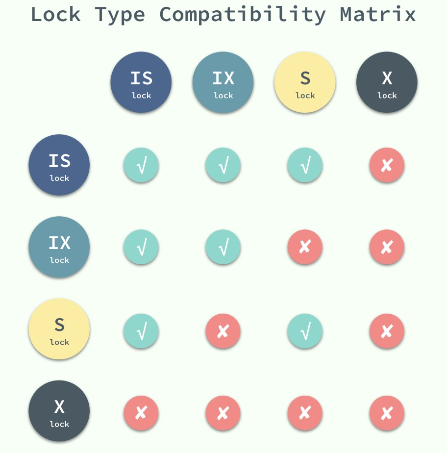

---

---

# MySQL与InnoDB

[『浅入浅出』MySQL 和 InnoDB](https://draveness.me/mysql-innodb)

[为什么你要用 InnoDB, 而不是 MyISAM ？](https://juejin.im/post/5c43ee36518825254b5a3c3a)

---

## MySQL 的架构

MySQL = 连接层 + Server 层 + 存储引擎层

- 连接层：用于连接、线程处理，并不是 MySQL 『发明』的

- Server 层：包含了大多数 MySQL 的核心服务，如 SQL 的解析、分析、优化和缓存等，存储过程、触发器、视图都是在这里实现的

- 存储引擎层：真正负责数据的存储和提取的存储引擎，例如：InnoDB、MyISAM 等

  

## 数据库 VS 实例

在 MySQL 中，我们无法直接操作数据库，而是要通过实例来操作数据库文件，实例和数据库往往都是一一对应的，数据库实例是数据库提供的用于操作的接口

# 数据库引擎：InnoDB

数据库引擎 （存储引擎）是数据库管理系统（DBMS）用于从数据库创建，读取，更新和删除（CRUD）数据的底层软件组件

MySQL的默认数据库引擎是InnoDB，也可以在 `create table` 语句中使用 `engine=...`设置


## InnoDB特点

1. InnoDB 支持外键，而 MyISAM 不支持
2. InnoDB 支持事务，MyISAM 不支持。
   InnoDB 默认将每一条 SQL 语言都封装成事务提交，这样会影响速度，所以最好把多条 SQL 语言放在 begin 和 commit 之间，组成一个事务
3. InnoDB 是聚集索引（clustered index），数据文件和索引绑在一起的，所以必须要有主键
   但是辅助索引（secondary index）需要先查询到主键，再通过主键查询到数据。因此主键不应该过大，否则其他索引也会很大

## 数据的存储形式

在 InnoDB 中，数据存放在中表空间（tablespace）中，在表空间的下面又包括段（segment）、区（extent）、页（page）



同一个数据库实例的所有表空间都有相同的页大小；默认情况，页大小都为 16KB

### 页：最小单位


- Page Header/Page Directory ：页的状态信息 
  Fil Header/Fil Trailer ：记录页的头信息

- Infimum 和 Supremum 是两个**虚拟**的记录（可以理解为占位符） 
  Infimum 记录是比该页中任何主键值都要小的值 
  Supremum 是该页中的最大值
- 其余的是记录和空闲空间

### 行数据存储形式

- 存储

  User Records 是一个**链表**的数据结构 
  为了保证插入和删除的效率，整个页面并不会按照主键顺序对记录进行排序，而是自动从左侧向右寻找空白节点插入 行记录之间的顺序是由 `next_record` 这一指针控制的

- 查找

  **B+ 树查找**记录时，只能获取记录所在的页，将整个页加载到内存中，不能直接返回值 再通过 Page Directory 中存储的稀疏索引和 `n_owned`、`next_record` 属性取出对应的记录 不过这一操作是在内存中进行的，所以通常会忽略这部分查找的耗时

  

## 表的存储形式

1. 使用 InnoDB 存储表时，会将**表的定义**存储在 `.frm` 文件中，**数据**存储在 `.ibd` 文件中
   - `.ibd`文件包括**系统表空间文件**（存储了 InnoDB 系统信息、用户数据库表数据和索引，是所有表公用的）和**独有表空间**（存储了当前表的数据和相关的索引数据）

2. 表是使用索引组织的，也就是按照键的顺序存放
   **聚集索引**是按照主键的顺序构建一颗**B+ 树**，并在叶子节点中存储一条记录中的**所有**信息

# 索引

1. 使得存储引擎能够快速定位记录，提升数据库的性能、减轻数据库服务器的负担
2. **索引优化**是对查询性能优化的最有效手段

### 聚集索引和辅助索引

- 聚集索引：

  - 叶节点存放一条记录的全部信息，不需要进行第二次操作

  - 所有正常的表**有且仅有一个**聚集索引（绝大多数情况下是主键）

  - 表中的所有行记录都是按照**聚集索引**的顺序存放的，是数据实际存储的形式

    

- 辅助索引：

  - 也是通过 B+ 树实现的

  - 叶节点 = 索引中的所有键 + 一个主键，用于查找对应行记录

  - 只用于加速数据的查找，并非数据实际存储的形式，一张表上往往有多个辅助索引

    

    添加辅助索引 `(first_name, age)`，可以看到叶节点并不是完整的行数据。且表的存储形式不改变

    

# 锁

锁的种类可以分为乐观锁和悲观锁，按照锁的粒度划分，也可以分成行锁和表锁

InnoDB 采用悲观锁 + 行锁

## 乐观锁 VS 悲观锁

乐观锁和悲观锁都是**并发控制机制** (在选择并发控制机制时，需要综合考虑（冲突频率、重试成本、响应速度和并发量）进行选择)

- 乐观锁
  - 先尝试对资源进行修改，在写回时判断资源是否进行了改变，如果没有发生改变就会写回，否则就重试
  - 是一种思想，并不是一种真正的锁，在整个的执行过程中其实都没有对数据库进行加锁
  - 不存在死锁问题
  - ❗️需要非常高的**响应速度**并且**并发量**非常大的时候使用
- 悲观锁
  - 在获取资源前对资源进行加锁，确保同一时刻只有有限的线程能够访问该资源，其他都会进入等待状态。直到该线程完成了对资源的操作并且释放了锁后，其他线程才能重新操作资源
  - 是一种真正的锁
  - ❗️当**冲突频率**和**重试成本**较高时使用




## 行锁 VS 表锁

共享锁（Shared Lock）和互斥锁（Exclusive Lock）是**行级锁**
意向锁（Intention Lock）是一种**表级锁**

对行进行锁操作前，先对表进行锁操作

- 行锁
  - 共享锁（读锁）
    - 允许事务对一条行数据进行读取
    - 共享锁之间是兼容的，并行读
  - 互斥锁（写锁）
    - 允许事务对一条行数据进行删除或更新
    - 互斥锁与其他任意锁都不兼容，串行写
- 表锁
  - 意向共享锁：表上加意向共享锁 → 记录加共享锁
  - 意向互斥锁：表上加意向互斥锁 → 记录加互斥锁



> 如果没有意向锁，当一个请求对表使用行锁时，如果另外一个请求要对全表进行修改，那么就需要对所有的行扫描，判断是否被锁定
> 在引入意向锁之后，使用行锁前会先为表添加意向互斥锁（IX），再为行添加互斥锁（X），在这时如果有人尝试对全表进行修改就不需要全表扫描了

## 锁的算法

### 记录锁

记录锁（Record Lock）是加到**索引记录**上的锁

```mysql
CREATE TABLE users(
    id INT NOT NULL AUTO_INCREMENT,
    last_name VARCHAR(255) NOT NULL,
    first_name VARCHAR(255),
    age INT,
    PRIMARY KEY(id),
    KEY(last_name),
    KEY(age)
)
```

- 索引 - 行锁，其余 - 表锁

  如果我们使用 `id` 或者 `last_name` 作为 `WHERE` 语句的过滤条件，那么 InnoDB 可以通过索引建立的 B+ 树找到行记录，并添加行锁
  但是如果使用 `first_name` 作为过滤条件，由于没有建立索引，无法找到对应的行，就会锁定整个表

### 间隙锁

间隙锁（Gap Lock）是对索引记录中的一段连续区域的锁

当使用类似 `SELECT * FROM users WHERE id BETWEEN 10 AND 20 FOR UPDATE;`时，间隙锁会锁定[10, 20]整个范围，阻止其他事务向表中插入如 `id = 15` 的记录

### Next-Key 锁

Next-Key 锁是记录锁和**当前记录前**的间隙锁的结合，可以解决幻读的问题

```
# 表
+------|-------------|--------------|-------+
|   id | last_name   | first_name   |   age |
|------|-------------|--------------|-------|
|    4 | stark       | tony         |    21 |
|    1 | tom         | hiddleston   |    30 |
|    3 | morgan      | freeman      |    40 |
|    5 | jeff        | dean         |    50 |
|    2 | donald      | trump        |    80 |
+------|-------------|--------------|-------+

# 锁定的范围
(-∞, 21]
(21, 30]
(30, 40]
(40, 50]
(50, 80]
(80, ∞)
```

当我们更新一条记录，比如 `SELECT * FROM users WHERE age = 30 FOR UPDATE;`，InnoDB 不仅会在范围 (21, 30] 上加 Next-Key 锁，还会在这条记录后面的范围 (30, 40] 加间隙锁，所以插入 (21, 40] 范围内的记录都会被锁定 (前加next-key，后加间隙锁)

## 死锁

死锁是指不同事务之间，可能会互相等待对方释放锁，最终导致事务发生错误

# 事务与隔离级别

## 四大特性

- 原子性（Atomicity）
  - 在数据提交工作时，要么保证所有的修改都能够提交，要么就所有的修改全部回滚。
- 一致性（Consistency）
- 隔离性（Isolation）
- 持久性（Durability）

## 隔离级别

事务的隔离级别是权衡**性能**和**可靠性**的配置项

- RAED UNCOMMITED
  - 不加锁
  - 导致脏读（Dirty Read ）：在一个事务中，读取了其他事务未提交的数据
- READ COMMITED
  - 只加记录锁，而不会在记录之间加间隙锁
  - 导致不可重复读（Non-Repeatable Read）：在一个事务中，同一行记录被访问了两次却得到了不同的结果
    原因是：在查询时不添加行锁，导致数据可被修改
- REPEATABLE READ
  - 多次读取同一范围的数据会返回第一次查询的快照，不会返回不同的数据行
  - 导致幻读（Phantom Read）：在一个事务中，一个范围内的记录被读取时，其他事务向这个范围添加了新的记录，而查询是无法得到新加入的记录的
- `SERIALIZABLE`：InnoDB 隐式地将全部的查询语句加上共享锁，解决了幻读的问题

